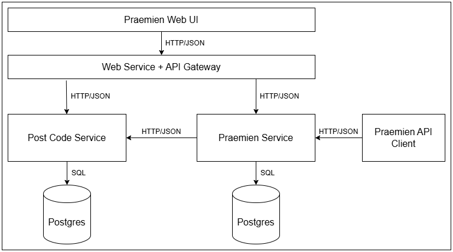

# VersicherungsPrämien Anwendung

Die VersicherungsPrämien Anwendung erlaubt es Kunden Prämienanträge zu stellen für eine fiktive Kraftfahrzeugversicherung

# Kommentare zur Challenge

- Architektonisch besteht die Anwendung aus drei Microservices. Anhand der fachlichen Domäne getrennt gibt es einen Service für die Ortsdaten und einen rund um die Prämien. Dazu kommt ein Webservice der ein Web UI serviert und API Anfragen an die anderen Services delegiert. Die Services kommunizieren untereinander und mit dem UI über HTTP/JSON APIs. Mehr dazu unter [Architektur](#architecture).

- Als Datenbank habe ich Postgres gewählt. Als opensource Projekt ist sie bewährter Industriestandard und ist mit vielen Systemen kompatibel. Ebenso ist PgAdmin ist ein praktisckes Tool zu deren Verwaltung mit dem ich sehr gute Erfahrung habe.

- Für die Tests wird JUnit benutzt. Dazu bietet RestAssure ein deklaratives Framework zum testen der HTTP Services. Die Testcases umfassen sowohl happy- als auch verschiedenste sad-cases um eine möglichst hohe Code-Coverage zu erreichen. Mithilfe von SpringRestDocs werden während der Testausführung Snippets für die Dokumentation generiert, was die Korrektheit der Dokumentation garantiert.

- Laut der Aufgabe soll der Kunde eine Postleitzahl eingeben, welche auf ein Bundesland abgebildet wird um den Region-Faktor zu ermitteln. Diese Abbildung ist jedoch nicht eindeutig, also es gibt Orte mit gleicher Postleitzahl in unterschiedlichen Bundesländern(z.B. 17337). Die hier implementierte Lösung sieht vor, dass der Kunde, nachdem er die Postleitzahl eingegeben hat, noch einen entsprechenden Ort auswählen muss. Dadurch wird die Zuordnung eindeutig. Der persistierte Prämienantrag enthält entsprechend die vollen Ortsdaten.

- Der Einfachheit halber habe ich die Komponente zur Berechnung der Prämie hart codiert. Die Werte für Fahrzeugtypen sowie die verschiedenen Faktoren sind im Sinne der Aufgabe frei erfunden. In Realität würde man eine dynamischere Lösung benötigen, etwa einen separaten Service.

- Eine simple Web Oberfläche habe ich in Angular erstellt. Da diese optional ist hat sie (noch) keine Tests.

- Der Rest von der README dient als Softwaredokumentation und ist, bis auf deutsche Domänenbegriffe, auf englisch verfasst.

# Architecture

The application consists of three microservices and a web UI. The services and the UI use HTTP and JSON for communication. Data is persisted in a Postgres SQL database. The services are deployed as docker images.

The responsibilities of the components are the following:

## PostCodeService
- loads location data into database
- serves locations for queried Postleitzahl

## PraemienService
- accepts PraemienAntrag requests
- validates requests using PostCodeService
- computes Praemie
- persists PraemienAntrag summary
- serves PraemienAntrag summary

## Web UI
- web form for convenient user input
- summary page

## WebService + API Gateway
- serves static Web UI distribution
- routes API requests to encapsulated backend services

#### Other Possible Responsibilities
- Authentication
- Session management
- Security issues

# Workflow
The workflow for a successful user request consists of the following steps:
- User enters Fahrzeugtyp, Kilometerleistung and Postleitzahl
- UI requests locations for provided Postleitzahl from PostCodeService
- User selects location and clicks send-button
- UI sends request to PraemienService
- PraemienService requests locations from PostCodeService to validate user request
- PraemienService calculates Praemie, persists summary and responds
- UI navigates to summary page

# Technology Stack

## Web Service
- **Spring Boot**, the standard for Java web services
- **Spring WebFlux**, the reactive framework allows an asynchroneous and resource efficient usage of service executor threads
- **Spring Cloud Gateway** to route UI requests to backend services

## Persistence
- **Postgres**, established SQL database
- **Spring R2DBC**, reactive database queries in accordance with Spring WebFlux
- **Liquibase** for database initialization

## Testing
- **JUnit**, standard Java testing framework
- **RestAssure** for declarative web service tests
- **TestContainers** is used to provide a postgres database in a container for tests
- **WireMock** to mock services in tests

## Documentation
- **AsciiDoc** to generate documentation for services
- **Spring RestDocs** uses tests to generate API documentation and ensure validity

## Deployment
- **Docker** standard for container deployment
- **Temurin & Alpine** a slim base image

## Frontend
- **Angular** web developement framework

# Quick Start

## Prequisites
- JDK distribution (21 or higher) in `JAVA_HOME` environment variable
- `docker` executable in `PATH` environment variable (tested with Docker v27.4.0)
- `npm` executable in `PATH` environment variable (tested with npm v10.9.2, NodeJs v23.7.0) 

## Build and Run
- Execute `build-all.bat` to build all components and create docker images for services.
- Execute `docker compose up -d` to start service stack. On initial startup the PostCodeService requires more time to initialize the database.
- Visit http://localhost/ .

## Test and Documentation
- Execute `test-docs-all.bat` to test the services and assemble documentation.
- The generated documentation can be found in the `docs/` folder.

# TODO
An incomplete list of tasks to make the application production-ready:
- security
- versioning
- CI/CD
- code formatting / lint
- logging
- UI tests
- UX
